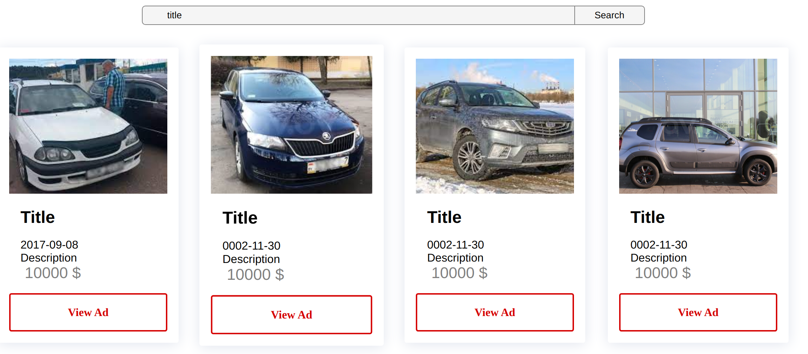

### ***Front-end part of the project***

* [Technical information](#tech-info)

* [Description of the project pages](#pages-info)

* [Features preview](#done-things)

___

#### Technical information

* Used technologies: ReactJS, Eslint(static code analyzer) and Prettier.

* Project build - WebPack.

___

##### Short description of project pages

* Main page (/)

- [x] Text search bar.
- [ ] Sign in/up buttons
- [ ] My profile button
    * settings
    * my ads
    * sign out
- [ ] Search with params.
- [ ] List of recently created ads.

___

* My ads page (/my-ads)

- [ ] List of all of your ads.
- [ ] Create new ad button.
- [ ] Maintain ad
    * Edit its info
    * Mark as sold
    * Delete

___

* Profile settings page (/profile)

- [ ] Set/change profile photo.
- [ ] Edit profile info(name, location, phone number etc.)
- [ ] Delete a profile.

___

* Viewing ad page

- [ ] All photos of an ad
- [ ] Title
- [ ] Description
- [ ] Contacts of an author

___

#### Features preview

***1. Search Bar and requested ads***

